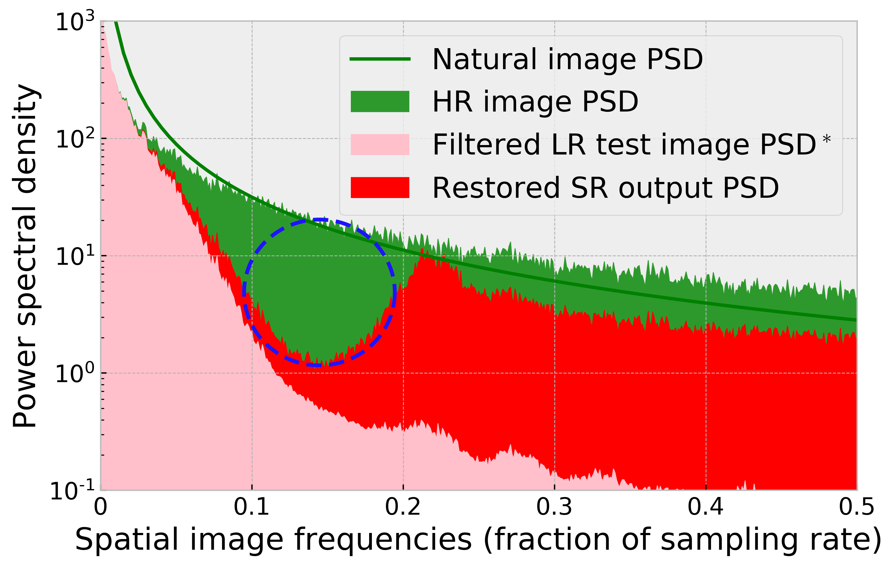
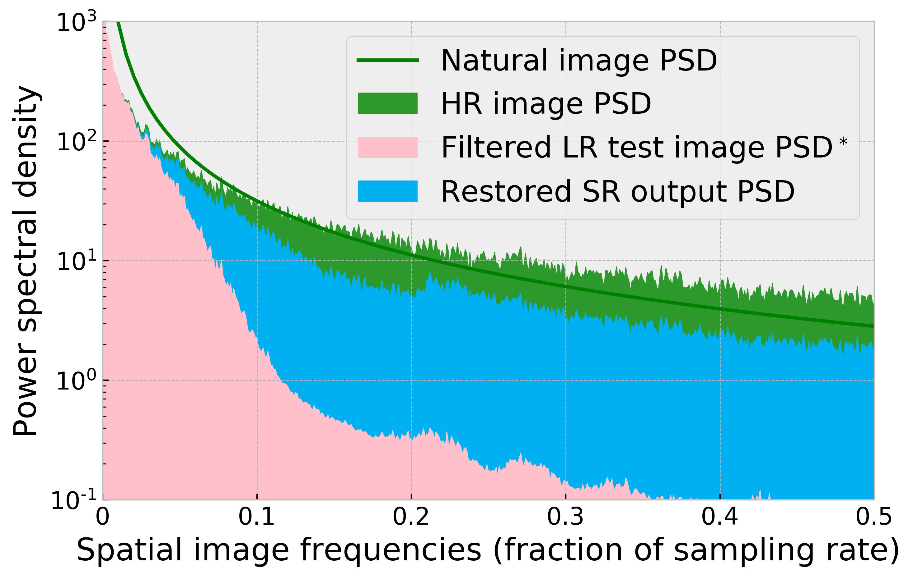
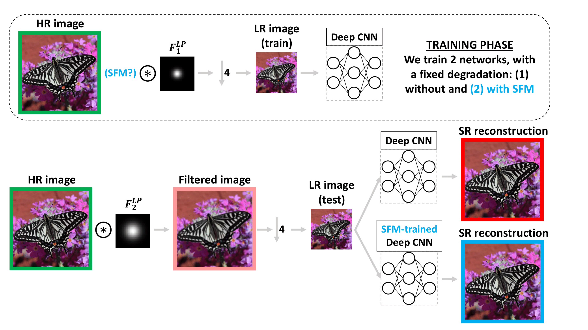
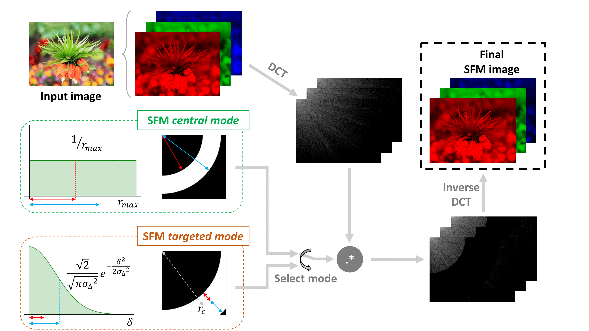
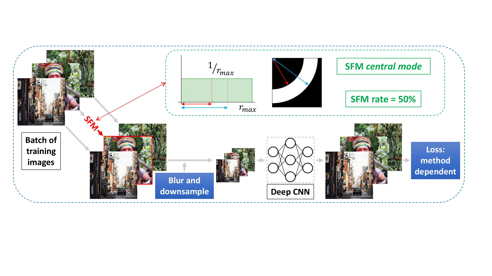
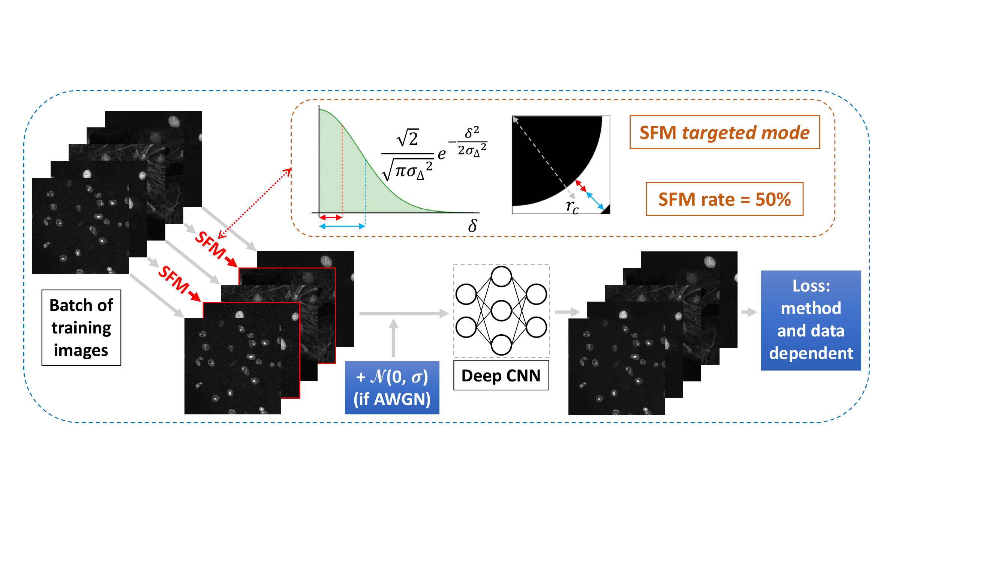

# Stochastic Frequency Masking for Learning Super-Resolution and Denoising
\> \*\*Abstract:\*\* \*Super-resolution and denoising are ill-posed yet fundamental image restoration tasks. In blind settings, the degradation kernel or the noise level are unknown. This makes restoration even more challenging, notably for learning-based methods, as they tend to overfit to the degradation seen during training. 

We present an analysis, in the frequency domain, of degradation-kernel overfitting in super-resolution and introduce a conditional learning perspective that extends to both super-resolution and denoising. Building on our formulation, we propose a stochastic frequency masking of images used in training to regularize the networks and address the overfitting problem. Our technique improves state-of-the-art methods on blind super-resolution with different synthetic kernels, real super-resolution, blind Gaussian denoising, and real-image denoising.\*

### [Supplementary Material](https://github.com/sfm-sr-denoising/sfm/blob/master/SFM_supp.pdf)

## Frequency perspective 
We visualize in the frequency domain the effect of training a super-resolution network with a certain degradation kernel, and testing it on a different one. An example illustration is shown below:

 

The regular network fails to reconstruct a certain range of frequencies correctly (highlighted with a blue dashed circle), while the one trained with our SFM can overcome this shortcoming. The details of this experiment (whose diagram is shown below) are described in our paper, and we present further visualizations of other experiments in our supplementary material.

<p align="center">
  
</p>


## Using SFM
SFM is carried out in our paper using the DCT for transforming to the frequency domain. Other frequency transforms could be used, but for DCT a sufficient **requirement** is ```scipy.fftpack```. Below is an overview of the two modes of our SFM, explained in detail in our paper:

<p align="center">
  
</p>

Adding a given rate of SFM into the training pipeline is a very straightforward step. Randomly select in each training batch the desired percentage of elements, and apply the mask to the selected training patches or images. The ```random_drop``` function supports the two modes of SFM described in the paper, and more functionalities are also implemented in ```utils_SFM```.

```python
import numpy as np
from utils_SFM import random_drop

DCT_DOR = 0.5 #for a 50% SFM rate (DCT dropout rate)
image_SFM = np.zeros(image.size(),dtype='float32')
dct_bool = np.random.choice([1, 0], size=(image.size()[0],), p=[DCT_DOR, 1-DCT_DOR])
for img_idx in range(image.size()[0]):
    if dct_bool[img_idx] == 1:
        # random_drop settings for targeted mode (used in denoising experiments):
        image_numpy, mask = random_drop(image[img_idx,].cpu().data.numpy(), mode=2, SFM_center_radius_perc=0.85, SFM_center_sigma_perc=0.15)
        image_SFM[img_idx,] = img_numpy
image = torch.from_numpy(image_SFM).cuda()
```

## SR experiments
To reproduce our SR experiments, we make the pre-trained models and re-training code/data available under [SR](SR/). All the details can be found in the README file in that directory. Below is the SR learning pipeline with SFM:
<p align="center">
  
</p>

## Denoising experiments
To reproduce our denoising experiments, we make the pre-trained models and re-training code/data available under [Denoising](Denoising/). All the details can be found in the README file in that directory. Below is the denoising learning pipeline with SFM:
<p align="center">
  
</p>


